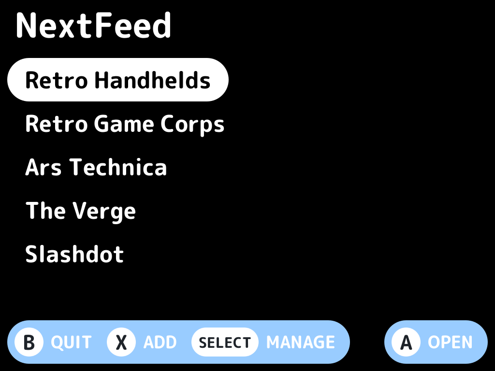
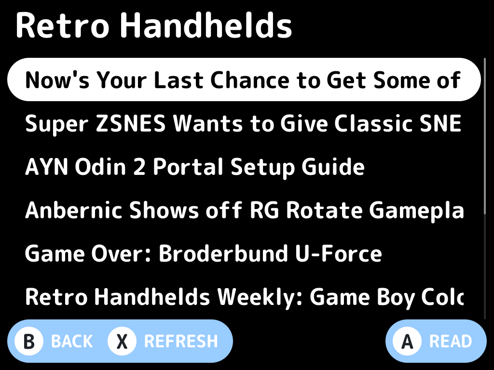
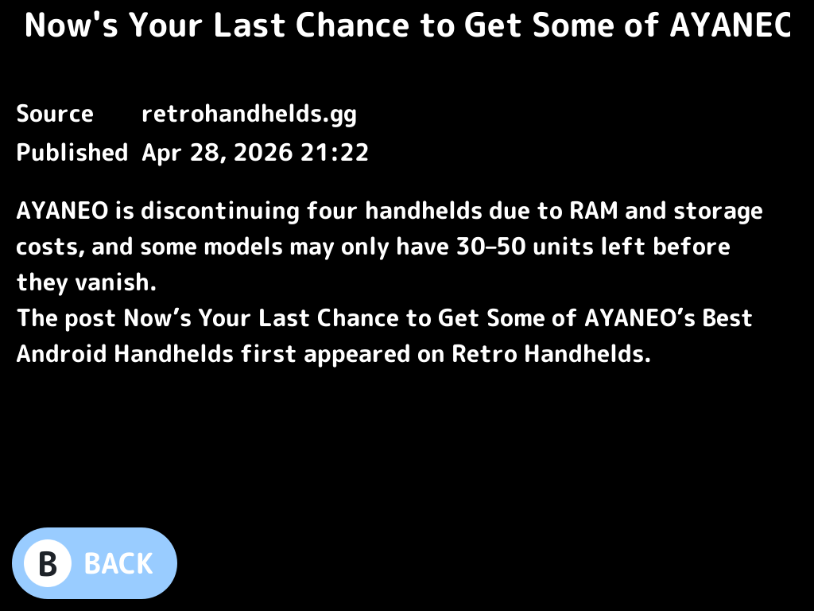

# NextFeed

An RSS/Atom feed reader for [NextUI](https://github.com/LoveRetro/NextUI) on TrimUI handheld devices.

Browse headlines from your favorite feeds directly on your TrimUI Brick or Smart Pro.

## Features

- **RSS 2.0 and Atom** feed support
- **On-device feed management** — add, edit, and delete feeds
- **Article detail view** with source, date, and description (when available)
- **Native NextUI look** via [Apostrophe](https://github.com/Helaas/Apostrophe) UI toolkit
- **HTTPS support** with bundled CA certificates
- **Loading indicators** during feed fetches
- **Refresh** from the article list
- **Persistent config** — feeds saved to `feeds.txt` on the SD card

## Supported Devices

| Device | Platform | Status |
|--------|----------|--------|
| TrimUI Brick | tg5040 | Working |
| TrimUI Smart Pro | tg5040 | Working |
| TrimUI Smart Pro S | tg5050 | Planned |
| Miyoo Flip | my355 | Planned |

## Screenshots

| Feed List | Article List | Article Detail |
|-----------|-------------|----------------|
|  |  |  |

## Installation

1. Download the latest release from the [Releases](../../releases) page
2. Extract the contents to your SD card so the pak lands at:
   `/Tools/tg5040/NextFeed.pak/`
3. Launch **NextFeed** from the Tools menu on your device
4. Make sure WiFi is enabled on your device

## Default Feeds

NextFeed ships with these feeds pre-configured:

- Retro Handhelds
- Retro Game Corps
- Ars Technica
- The Verge
- Slashdot

You can add, edit, or delete feeds from the feed list screen on the device.

## Controls

### Feed List

| Button | Action |
|--------|--------|
| A | Open feed |
| X | Add new feed |
| Select | Manage feed (edit/delete) |
| B | Quit |

### Article List

| Button | Action |
|--------|--------|
| A | Read article |
| X | Refresh feed |
| B | Back to feeds |

### Article Detail

| Button | Action |
|--------|--------|
| Up/Down | Scroll |
| B | Back to articles |

### Keyboard (adding/editing feeds)

| Button | Action |
|--------|--------|
| A | Select key |
| B | Backspace |
| Start | Confirm input |
| Y | Cancel |

## Building from Source

### Prerequisites

- Docker (or OrbStack on macOS)
- The tg5040 toolchain image: `ghcr.io/loveretro/tg5040-toolchain`
- Git (for submodules)

### Clone

```bash
git clone --recursive https://github.com/ericreinsmidt/nextui-rss-reader.git
cd nextui-rss-reader
```

If you already cloned without `--recursive`:

```bash
git submodule update --init --recursive
```

### Build libcurl (first time only)

```bash
docker run --rm \
  -v "$(pwd)":/workspace \
  ghcr.io/loveretro/tg5040-toolchain \
  /workspace/third_party/apostrophe/scripts/build_third_party.sh ensure-curl tg5040
```

### Stage CA certificates (first time only)

```bash
mkdir -p build/tg5040
docker run --rm \
  -v "$(pwd)":/workspace \
  ghcr.io/loveretro/tg5040-toolchain \
  /workspace/third_party/apostrophe/scripts/build_third_party.sh stage-runtime-libs tg5040 \
  /workspace/build/tg5040/nextfeed /workspace/build/tg5040/lib
```

### Build NextFeed

```bash
bash scripts/build_tg5040_docker.sh
```

### Package for deployment

```bash
cp build/tg5040/nextfeed ports/tg5040/pak/bin/nextfeed
chmod +x ports/tg5040/pak/bin/nextfeed
mkdir -p ports/tg5040/pak/lib
cp build/tg5040/lib/cacert.pem ports/tg5040/pak/lib/cacert.pem
```

Then copy `ports/tg5040/pak/` to `/Tools/tg5040/NextFeed.pak/` on your SD card.

## Project Structure

```
nextui-rss-reader/
├── src/
│   └── main.c                 # Application source
├── assets/
│   └── feeds/
│       └── default_feeds.txt    # Default feed list (source of truth)
├── ports/
│   └── tg5040/
│       ├── Makefile              # Cross-compile makefile
│       └── pak/
│           ├── launch.sh          # Pak entrypoint
│           ├── pak.json           # Pak metadata
│           ├── bin/               # Built binary (not in repo)
│           ├── lib/               # CA certs (not in repo)
│           └── assets/
│               └── feeds/
│                   └── default_feeds.txt
├── scripts/
│   ├── build_tg5040_docker.sh
│   ├── package_pak.sh
│   └── sync_feeds.py
├── third_party/
│   └── apostrophe/              # Git submodule
├── pak.json
├── Makefile
├── LICENSE
└── README.md
```

## Runtime Paths

On-device, NextFeed stores data at:

| Path | Purpose |
|------|---------|
| `/mnt/SDCARD/.userdata/tg5040/nextfeed/config/feeds.txt` | User's feed list |
| `/mnt/SDCARD/.userdata/tg5040/nextfeed/cache/` | Feed cache (future) |
| `/mnt/SDCARD/.userdata/tg5040/logs/nextfeed.log` | Log file |

## Acknowledgments

- **[NextUI](https://github.com/LoveRetro/NextUI)** — Custom firmware for TrimUI devices by LoveRetro.
- **[Apostrophe](https://github.com/Helaas/Apostrophe)** — C UI toolkit for NextUI paks by Helaas. Provides the native-looking list, detail, keyboard, and dialog widgets used throughout NextFeed. MIT licensed.
- **[libcurl](https://curl.se/)** — HTTP client library. Built as a static library for HTTPS feed fetching.

## License

MIT — see [LICENSE](LICENSE) for details.
