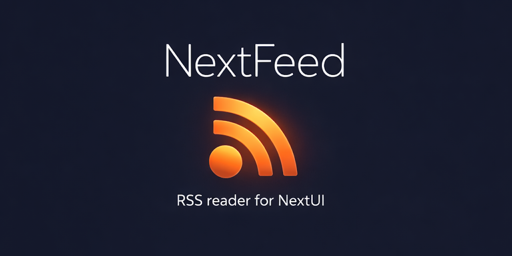
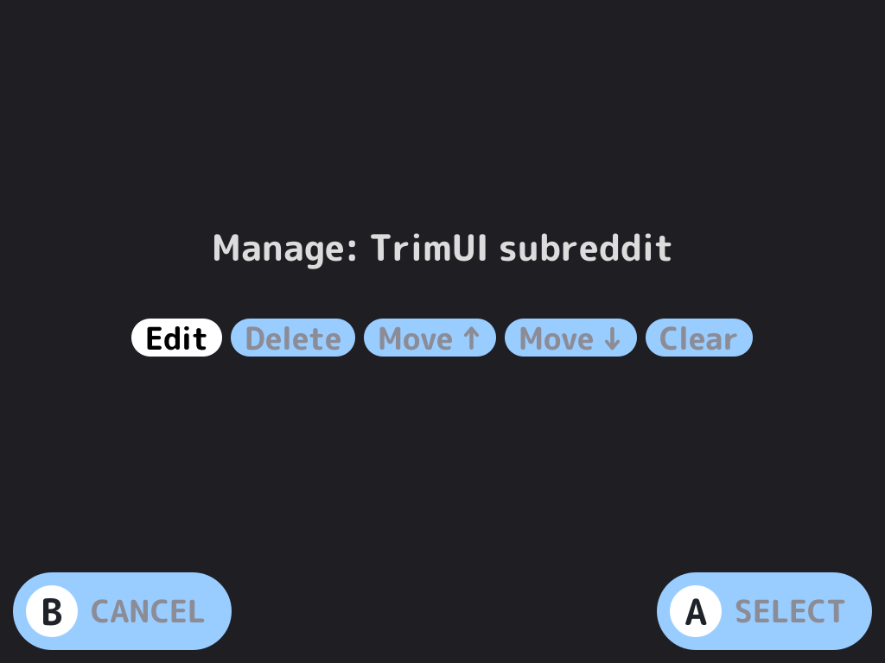
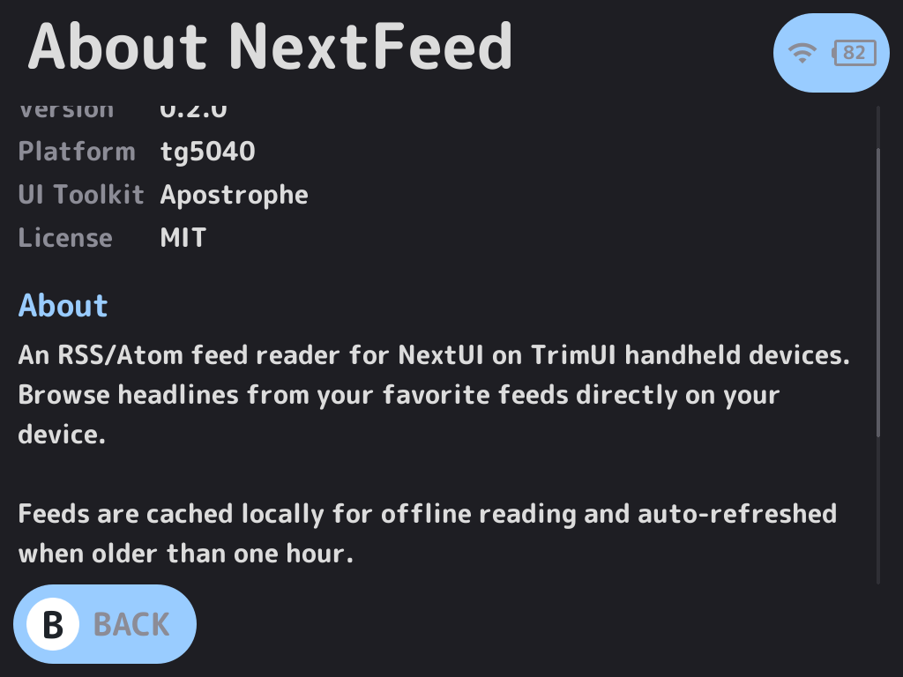

# NextFeed

An RSS/Atom feed reader for [NextUI](https://github.com/LoveRetro/NextUI) on TrimUI handheld devices.

Browse headlines from your favorite feeds directly on your TrimUI Brick or Smart Pro.

Built with [PakKit](https://github.com/ericreinsmidt/pakkit) and [Apostrophe](https://github.com/Helaas/Apostrophe).

## Features

- **RSS 2.0 and Atom** feed support
- **On-device feed management** -- add, edit, delete, and reorder feeds
- **Offline reading** -- feeds cached locally, auto-refreshed when older than one hour
- **Article detail view** with source domain, publish date, and scrollable description
- **On-screen keyboard** with URL shortcut buttons for easy feed entry
- **Article count** shown next to each feed name
- **Loading indicators** during feed fetches
- **Refresh** individual feeds from the article list
- **Reddit support** -- add any subreddit as a feed
- **Persistent config** -- feeds saved to SD card
- **HTTPS support** with bundled CA certificates
- **Minimal UI** -- clean PakKit screens with subtle button hints

## Supported Devices

| Device | Platform | Status |
|--------|----------|--------|
| TrimUI Brick | tg5040 | Working |
| TrimUI Smart Pro | tg5040 | Working |

## Screenshots

| Feed List | Article List | Article Detail |
|-----------|-------------|----------------|
|  |  |  |

| Manage Feed | About |
|-------------|-------|
|  |  |

## Installation

1. Download the latest release from the [Releases](../../releases) page
2. Extract the contents to your SD card so the pak lands at:
   /Tools/tg5040/NextFeed.pak/
3. Launch **NextFeed** from the Tools menu on your device
4. Make sure WiFi is enabled on your device

## Default Feeds

NextFeed ships with these feeds pre-configured:

- Retro Handhelds
- Retro Game Corps
- Ars Technica
- The Verge
- Slashdot

You can add feeds from the feed list screen and edit or delete them from the menu. Add any subreddit with /.rss after the subreddit URL, e.g., https://reddit.com/r/example/.rss

## Controls

### Feed List

| Button | Action |
|--------|--------|
| A | Open feed |
| X | Add new feed |
| Y | Menu (manage feed, about) |
| B | Quit |

### Menu

| Option | Description |
|--------|-------------|
| Manage Feed | Edit, delete, reorder, or clear cache for selected feed |
| About | Version info and credits |

### Article List

| Button | Action |
|--------|--------|
| A | Read article |
| X | Refresh feed |
| B | Back to feeds |

### Article Detail

| Button | Action |
|--------|--------|
| Up/Down | Scroll |
| B | Back to articles |

### Keyboard

| Button | Action |
|--------|--------|
| A | Type selected key |
| B | Backspace |
| Start | Confirm input |
| Y | Cancel |
| L1 | Toggle shift |
| R1 | Toggle symbols |

## Building from Source

### Prerequisites

- Docker (or OrbStack on macOS)
- The tg5040 toolchain image: ghcr.io/loveretro/tg5040-toolchain
- Git (for submodules)

### Clone

    git clone --recursive https://github.com/ericreinsmidt/nextui-rss-reader.git
    cd nextui-rss-reader

If you already cloned without --recursive:

    git submodule update --init --recursive

### Build libcurl (first time only)

    docker run --rm \
      -v "$(pwd)":/workspace \
      ghcr.io/loveretro/tg5040-toolchain \
      /workspace/third_party/apostrophe/scripts/build_third_party.sh ensure-curl tg5040

### Stage CA certificates (first time only)

    mkdir -p build/tg5040
    docker run --rm \
      -v "$(pwd)":/workspace \
      ghcr.io/loveretro/tg5040-toolchain \
      /workspace/third_party/apostrophe/scripts/build_third_party.sh stage-runtime-libs tg5040 \
      /workspace/build/tg5040/nextfeed /workspace/build/tg5040/lib

### Build

    make tg5040-docker

### Package

    cp build/tg5040/nextfeed ports/tg5040/pak/bin/nextfeed
    chmod +x ports/tg5040/pak/bin/nextfeed
    mkdir -p ports/tg5040/pak/lib
    cp build/tg5040/lib/cacert.pem ports/tg5040/pak/lib/cacert.pem

Then copy ports/tg5040/pak/ to /Tools/tg5040/NextFeed.pak/ on your SD card.

## Project Structure

    nextui-rss-reader/
    +-- src/
    |   +-- main.c                     # Application source
    +-- assets/
    |   +-- feeds/
    |   |   +-- default_feeds.txt      # Default feed list
    |   +-- screenshots/               # README screenshots
    +-- ports/
    |   +-- tg5040/
    |       +-- Makefile               # Cross-compile makefile
    |       +-- pak/
    |           +-- launch.sh          # Pak entrypoint
    |           +-- pak.json           # Pak metadata
    |           +-- bin/               # Built binary (not in repo)
    |           +-- lib/               # CA certs (not in repo)
    |           +-- assets/
    |               +-- feeds/
    |                   +-- default_feeds.txt
    +-- scripts/
    |   +-- build_tg5040_docker.sh
    |   +-- package_pak.sh
    |   +-- sync_feeds.py
    +-- third_party/
    |   +-- apostrophe/                # Git submodule
    |   +-- pakkit/                    # Git submodule
    +-- pak.json
    +-- Makefile
    +-- LICENSE
    +-- README.md

## Runtime Paths

| Path | Purpose |
|------|---------|
| /mnt/SDCARD/.userdata/tg5040/nextfeed/config/feeds.txt | User's feed list |
| /mnt/SDCARD/.userdata/tg5040/nextfeed/cache/ | Cached feed XML |
| /mnt/SDCARD/.userdata/tg5040/logs/nextfeed.txt | Log file (current session only) |

## Tech Stack

- **Language:** C (single-file architecture)
- **UI Components:** [PakKit](https://github.com/ericreinsmidt/pakkit) + [Apostrophe](https://github.com/Helaas/Apostrophe) by Helaas
- **HTTP:** libcurl with static OpenSSL
- **Target:** TrimUI Brick / Smart Pro (tg5040) running NextUI

## Credits

- **NextFeed** by Eric Reinsmidt
- **[PakKit](https://github.com/ericreinsmidt/pakkit)** UI components by Eric Reinsmidt
- **[Apostrophe](https://github.com/Helaas/Apostrophe)** UI toolkit by [Helaas](https://github.com/Helaas)
- **[NextUI](https://github.com/LoveRetro/NextUI)** by [LoveRetro](https://github.com/LoveRetro)

## License

MIT -- see [LICENSE](LICENSE) for details.
